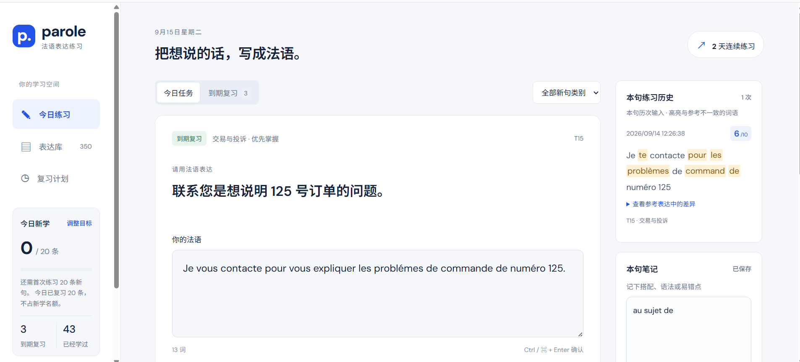
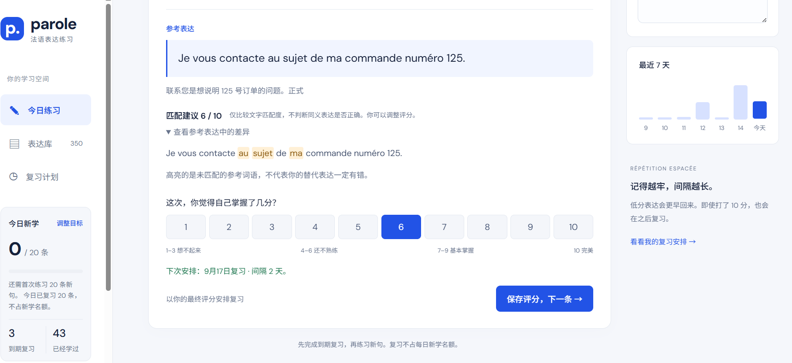
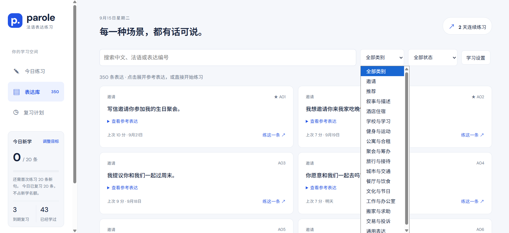

# Parole · Everyday language practice / 日常语言表达练习

Parole helps you practise everyday expressions across topics through active recall, AI feedback and spaced repetition. The interface defaults to English and can switch to Chinese. Choose your prompt/explanation language and the language you want to practise independently.

Parole 面向 B1–B2 学习者，帮助你按各种 topic 积累日常表达，通过主动回忆和间隔复习，把表达真正记住。法语示例句集可以用于 TCF 备考，也可以创建其他语言的句集。

## Languages & account / 语言与账户

- Click the person icon at the top right for interface language, learning languages, settings/backup and Google sign-in. The sidebar can collapse; both UI preferences stay in this browser.
- Learning settings support Chinese, English, French, Spanish, German, Italian, Portuguese, Japanese, Korean, Arabic, Russian and Hindi. Text assessment and audio assessment use the selected pair; speech transcription uses the target language.
- Learning languages are included in study backups and account sync. Existing sets, answers, notes and history are not translated or rewritten. Pick or create sets that match your language pair. Existing records default to Chinese → French.
- 界面语言与学习语言独立：右上角切换中文/英文；学习设置选择提示与解释语言、目标语言。学习语言随账户同步，界面语言和导航收起状态保存在当前浏览器。
- 登录使用 Google 账户；无需旧版同步密钥。键盘输入使用文字评分，录音输入使用口语评分，模型反馈以意思准确、自然表达为先。

它也可以用于准备 **TCF 写作任务 1 和 2（Tâche 1 / Tâche 2）**：练习邀请、推荐、叙事与描述，积累各种场景的句子，再迁移到消息、邮件和经历分享等写作中。它是表达训练工具，不是整篇作文的自动评分系统。

## 怎么练习

1. 看提示，用目标语言输入表达（也可录音转写）。
2. 确认后揭晓参考表达，查看词语差异。
3. 参考文字匹配建议，给自己打 1–10 分。
4. 保存评分，系统安排下次复习。
5. 在本句笔记中记录搭配、语法和易错点。

每个句子都有独立练习历史，保留时间、你输入的表达和分数，并高亮与参考表达不一致的词语。以下截图展示原有中文学法语的用法。



## 反馈与复习

- 每日默认 **新学 20 条**，只统计第一次练习的句子，可调整目标。
- **到期复习必须先完成**，复习不占新学名额；类别筛选也不会跳过到期复习。
- 按最终自评分安排间隔：低分更快回来，高分逐步延长；10 分也会继续复习。
- 自动匹配只比较文字，不判断同义表达或语法是否正确。高亮代表与参考不一致，不代表你的表达一定有错；最终评分由你决定。



排程参考 SM-2 思路做了调整，并非原版 SM-2 或 FSRS。1–3 分在 10 分钟后重学；4–5 分隔 1 天；6–10 分首次分别间隔 1、1、2、3、4 天。后续结合难度、上次间隔与评分增长，最长 365 天。提前练习时，6 分以上保留原复习日期，5 分以下重新安排。

## 按话题积累表达

在句集中点击「添加表达」，可选择 **单条添加** 或 **AI 批量生成**。批量生成可填写应用场景、单条期望长度、风格（自然口语、边想边说、日常书面语、正式书面语）和数量（1–50 条，默认 20）。使用已保存的 OpenAI API Key 调用 [GPT-5.4 mini](https://developers.openai.com/api/docs/models/gpt-5.4-mini)，按 API 用量计费；学习语言沿用学习设置。

生成后先预览：可编辑题目、参考表达、类别、说明和优先标记，取消勾选不需要的表达，再点击「加入当前句集」。加入时跳过当前句集中相同的参考表达，不覆盖已有句子或练习记录。生成失败、取消或关闭预览不会自动添加；重新生成会先确认是否替换预览。

Choose **Add one** or **Generate with AI** inside a set. Describe a situation, expected length, style and quantity, then review and edit the generated items before adding them. Uses your saved API key and chosen learning languages. Existing progress is retained; exact duplicate expressions in the destination set are skipped.

表达库按「句集」组织。初始 350 条表达放在 **TCF Écrite Tâche1** 中；可以新建、搜索、编辑和归档自己的句集。

- 勾选「加入每日练习」可同时启用多个句集，合计共用每日新学目标（默认 20 条）。切换句集不会重置当天已完成的新学数量。
- 未选中的句集暂停出题和复习，原复习日期和学习记录保留。重新选中后，已到期内容恢复进入队列；所有选中句集的到期复习必须优先完成。
- 在句集中添加、编辑或删除表达，保留中文、法语、类别、补充说明和优先掌握标记。旧数据的维度保留在备份中，不再显示在表单里。类别可自由输入。
- 支持按中文、法语、编号搜索，按类别和学习状态筛选，批量移动或删除表达。移动时保留学习记录，并遵循目标句集的练习开关。
- 删除表达或归档句集会进入回收站，可恢复；归档句集恢复后默认暂停。彻底删除需确认，并清除对应表达的评分和笔记。
- 编辑不会清除历史、笔记或复习计划。已学表达可以单独「重置复习计划」，立即进入到期队列，同时保留历史与笔记。

首次加载会把旧版进度迁移到新版 `parole.study.v2`；原 `parole.study.v1` 数据保留，不会覆盖。新版备份包含全部句集、自建表达、回收站和学习记录，也支持导入旧版备份。API Key 继续独立保存，不包含在备份中。不同网址或浏览器的记录需要通过备份迁移。

内置 **350 条表达、16 个类别**，涵盖邀请、推荐、叙事与描述，以及酒店住宿、学校学习、健身运动、公寓合租、聚会、旅行、交通、餐饮、文化、工作、搬家、交易投诉和通用表达。

可以搜索中文、法语或编号，并按类别和学习状态筛选。初始内容围绕 Tâche 1 常见表达整理，也可作为 Tâche 2 日常叙述与分享的句型素材；并非官方题库。



## 在 Chrome 中使用

原生 HTML、CSS 和 JavaScript 静态应用，无需安装前端依赖。基础练习无需密钥；可选的 AI 评分使用你自己的 OpenAI API Key。

安装 Python 3 后，在仓库根目录运行：

```sh
python -m http.server 4317 --bind 127.0.0.1 --directory dist
```

然后在 Chrome 打开 <http://127.0.0.1:4317/>。Windows 也可以把 `python` 换成 `py`。也可以用其他静态服务器托管 `dist` 目录。

## 可选：OpenAI AI 句子评分

打开「学习设置与备份」，在「AI 句子评分」中输入自己的 API Key，勾选自动评分并点击「保存 AI 设置」。默认使用 GPT-4o mini。可以点击「测试连接」发送一个示例句子，测试也会产生少量 API 费用。

确认答案后，AI 根据中文意思、语法和自然度给出 1–10 分、中文解释、原句错误高亮及最小修改建议。正确的同义表达不会因为与参考句不同而被要求扣分。AI 分数仍可能不准确，你可以调整最终分数；只有保存评分才会更新复习计划。AI 等待期间你手动选择的分数不会被后来的结果覆盖。

密钥由你输入后保存在当前网站的浏览器 localStorage 中，刷新后仍可使用；它未加密，同源脚本和有权限的扩展可能读取。请只在可信的个人设备和可信版本上使用。「删除已保存密钥」会移除本机记录，不会撤销 OpenAI 平台上的密钥。不要把密钥提交到 GitHub。

浏览器直接请求 `https://api.openai.com/v1/responses`，无需部署后端。仅发送评分规则和当前句子的中文、类别、法语输入及参考表达，不发送学习历史或笔记。请求使用 `store: false`。密钥使用独立存储项 `parole.openai.v1`，不会进入学习备份；导入备份也不会覆盖密钥。

未设置 Key、余额不足、网络失败或超时时，仍可使用本地文字匹配与自评分。无自动付费重试；点击重试会再次调用 API。AI 详细解释只显示在本次页面中，最终分数和原始法语输入仍按原有方式进入练习历史。

## 数据与提醒

进度、历史、草稿和每句笔记默认保存在当前浏览器的 localStorage 中，笔记自动保存。支持导出 JSON 备份与导入恢复。可选接入 MongoDB Atlas + Vercel 云同步，用同一把个人同步密钥跨设备访问句集、笔记和练习记录；遇到两端同时修改会暂停并提示选择，不静默覆盖。草稿、录音和 OpenAI Key 不上传。部署步骤见 [云同步说明](docs/cloud-sync.md)。更换网站地址、端口或浏览器配置会使用不同存储空间，迁移前请先导出备份。

默认每日当地时间 20:00 提醒，可调整并下载 ICS 文件导入电脑或手机日历。日历提醒是固定的每日练习提醒，不会与浏览器中的进度动态同步；实际到期清单在应用内查看。网页通知需要授权且页面保持运行。

## 项目结构与验证

```text
dist/          可直接托管的应用和词库
tests/         核心逻辑测试
docs/images/   应用截图
```

使用 Node.js 18 或以上运行测试：

```sh
node --test tests/core.test.cjs tests/ai.test.cjs tests/collections.test.cjs
```

测试覆盖词库完整性、排程、匹配评分、首次新学统计、历史、笔记、备份校验和日历文件等核心逻辑。

### 语音输入与口语练习

在练习页打开「语音输入」，点击开始录音，用法语表达，停止后通过 OpenAI `gpt-4o-mini-transcribe` 转写为法语并追加到输入框。可修改后确认，继续使用自评分或 AI 句子评分。复用学习设置中的个人 API Key；无需后端。每次最长 2 分钟，录音仅临时留在内存，不加入学习备份。转写按 API 用量计费，语音识别与文字评分不等同于发音评分。麦克风需要浏览器授权，建议使用 HTTPS 线上版。

## 示例与个人句集

仓库仅内置 **TCF Écrite Tâche1** 的 350 条示例表达。其他句集由用户在应用内创建或导入，通过云同步保存在 MongoDB，并保留浏览器本地副本。仓库不再打包口语资料、下载文件或自动导入入口。升级不会删除已有句集、笔记或历史；新设备请先连接云同步，再选择使用完整的云端记录。
